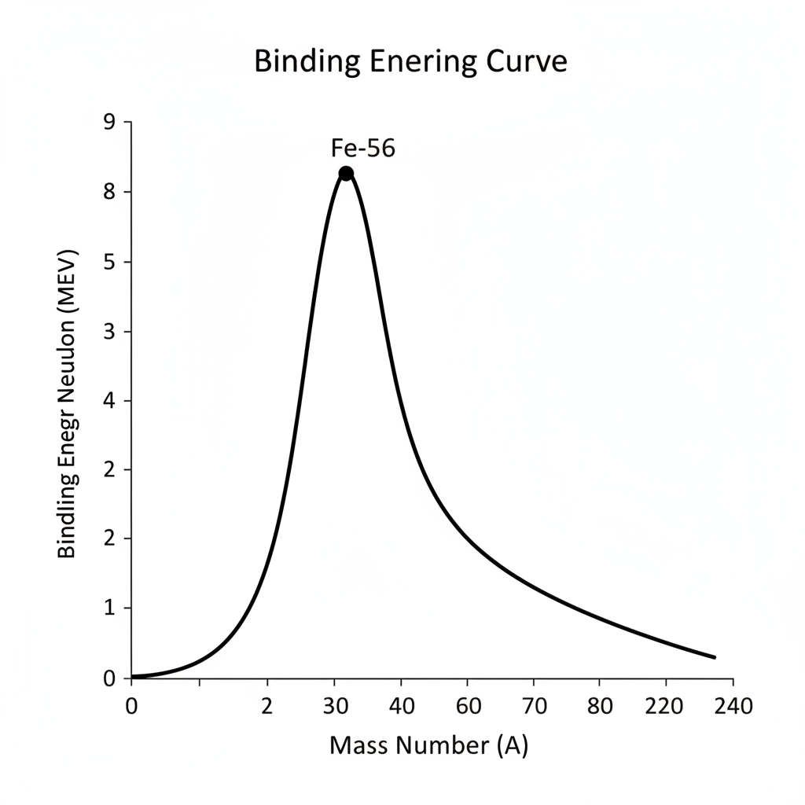
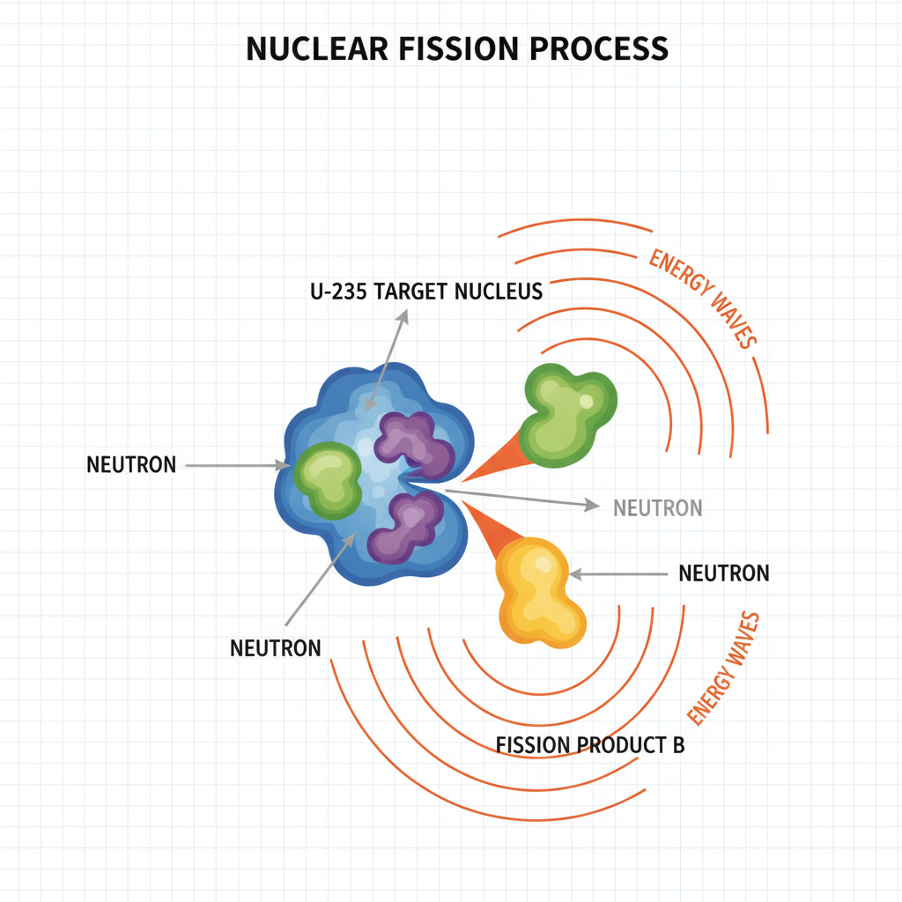
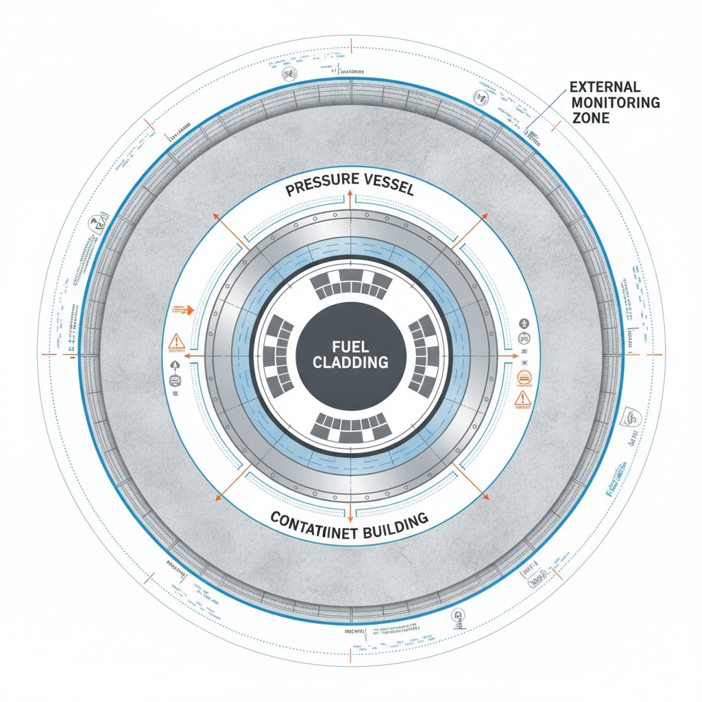

# Nuclear Physics for Software Engineers: Understanding Energy and Stability

## The Fundamentals of Nuclear Binding Energy

At the heart of nuclear stability lies the mass defect—the discrepancy between the mass of a nucleus and the sum of its individual protons and neutrons. According to Einstein’s mass-energy equivalence, $E=mc^2$, this "missing" mass is converted into the binding energy that holds the nucleus together. When nucleons bind, the system releases energy, resulting in a lower total mass than the constituent parts.


*The binding energy per nucleon curve showing the peak stability at Iron-56.*

Stability is a constant tug-of-war between two fundamental forces:
*   **Electrostatic Repulsion:** Protons, all positively charged, exert a long-range repulsive force on one another.
*   **Strong Nuclear Force:** This is an attractive, short-range force that acts between all nucleons. It is significantly stronger than electromagnetism at femtometer scales, effectively overcoming the repulsion to maintain structural integrity.

To quantify this stability, we look at the binding energy per nucleon. This metric reveals how tightly a nucleus is held together. As we move across the periodic table, this value increases for lighter elements as the strong force dominates. However, as nuclei grow larger, the short-range nature of the strong force means it cannot effectively bridge the distance across the entire nucleus, while the long-range electrostatic repulsion continues to grow.

This trend reaches its zenith at Iron-56 ($^{56}\text{Fe}$). Iron-56 possesses the highest binding energy per nucleon, making it the most stable nucleus. Beyond this peak, the energy cost of adding more nucleons outweighs the benefits of the strong force, leading to the instability observed in heavier, radioactive elements that undergo fission to reach a more stable state.

## Simulating Radioactive Decay with Monte Carlo Methods

Radioactive decay is inherently stochastic, making it an ideal candidate for Monte Carlo simulation. At the atomic level, the probability of a specific nucleus decaying within a time interval $\Delta t$ is governed by the decay constant $\lambda$. We model this as a Poisson process where each nucleus acts as an independent Bernoulli trial.

### Implementation Strategy

To simulate a population of $N$ atoms, we iterate through discrete time steps. In each step, we determine how many atoms decay by sampling from a binomial distribution, or more simply, by checking each atom against a probability threshold $P = 1 - e^{-\lambda \Delta t}$.

```python
import numpy as np
import matplotlib.pyplot as plt

def simulate_decay(n_atoms, lambda_val, time_steps):
    population = [n_atoms]
    for _ in range(time_steps):
        # Probability of decay per atom in this step
        prob = 1 - np.exp(-lambda_val)
        decayed = np.random.binomial(population[-1], prob)
        population.append(population[-1] - decayed)
    return population

# Parameters
atoms = 10000
decay_constant = 0.05
steps = 100

data = simulate_decay(atoms, decay_constant, steps)
plt.plot(data)
plt.title("Radioactive Decay Simulation")
plt.xlabel("Time Steps")
plt.ylabel("Remaining Atoms")
plt.show()
```

### Visualization and Performance

The resulting plot demonstrates the characteristic exponential decay curve. As the population decreases, the absolute number of decays per step drops, reflecting the reduction in available "targets." This visualization confirms that the stochastic simulation converges to the theoretical decay law $N(t) = N_0 e^{-\lambda t}$ as the sample size increases.

## Nuclear Fission: Mechanics and Energy Release

Nuclear fission occurs when a heavy, unstable nucleus, such as Uranium-235, absorbs a thermal neutron. This absorption creates an excited state (U-236), which is highly unstable and undergoes rapid deformation. The nucleus eventually splits into two smaller "fission fragments," typically isotopes of barium and krypton, while simultaneously releasing two to three high-energy neutrons and a significant amount of electromagnetic radiation.


*A neutron strikes a U-235 nucleus, causing it to split into fission fragments and releasing additional neutrons.*

The energy yield of this process is derived from the mass defect—the difference in mass between the parent nucleus and the sum of the products. According to Einstein’s mass-energy equivalence ($E=mc^2$), this missing mass is converted into kinetic energy. A single U-235 fission event releases approximately 200 MeV of energy. To put this in perspective, this is roughly 20 million times the energy released by burning a single molecule of methane, illustrating the extreme density of nuclear fuel.

A chain reaction occurs when the neutrons released from one fission event trigger subsequent fissions in neighboring nuclei. For this to be self-sustaining, the system must reach "critical mass"—the minimum amount of fissile material required to maintain a constant fission rate. If the mass is subcritical, the reaction dies out; if supercritical, the reaction rate grows exponentially, which is the principle behind both power reactors and nuclear weaponry.

## Performance and Safety Considerations in Nuclear Systems

Nuclear power generation relies on the conversion of thermal energy into mechanical work, typically via the Rankine cycle. The thermal efficiency of these systems is fundamentally constrained by the Carnot limit, defined by the temperature differential between the reactor core and the heat sink. In practice, nuclear plants operate at lower temperatures than fossil-fuel counterparts to maintain material integrity, resulting in typical thermal efficiencies between 30% and 35%. Engineers must balance high-pressure steam requirements against the risk of thermal fatigue in piping and pressure vessels.

Safety protocols focus on mitigating catastrophic failure modes, primarily centered on the "defense-in-depth" philosophy. Two critical failure scenarios include:
*   **Loss-of-Coolant Accident (LOCA):** A breach in the primary cooling loop leads to a rapid drop in pressure and potential core exposure. Without active or passive cooling, decay heat can cause fuel cladding to melt.
*   **Control Rod Malfunction:** If the neutron-absorbing rods fail to insert during a scram event, the chain reaction may continue, leading to a power excursion. Redundant, gravity-fed, or spring-loaded insertion mechanisms are standard to ensure fail-safe operation.


*The defense-in-depth model showing concentric layers of safety barriers in a nuclear reactor.*

## Debugging and Observability in Physics Simulations

Verifying the integrity of a nuclear physics simulation requires a rigorous approach to observability, as small floating-point errors can propagate into physically impossible states.

### Implementing Conservation Laws

The first line of defense is unit testing for fundamental conservation laws. In any simulation of nuclear decay or fusion, the total mass-energy must remain invariant within the system boundaries. You should implement assertions that verify:
*   **Baryon Number Conservation:** The sum of protons and neutrons remains constant across all reaction steps.
*   **Energy Balance:** The sum of kinetic energy and mass-energy (via $E=mc^2$) must match the initial state, accounting for any external work or heat exchange.